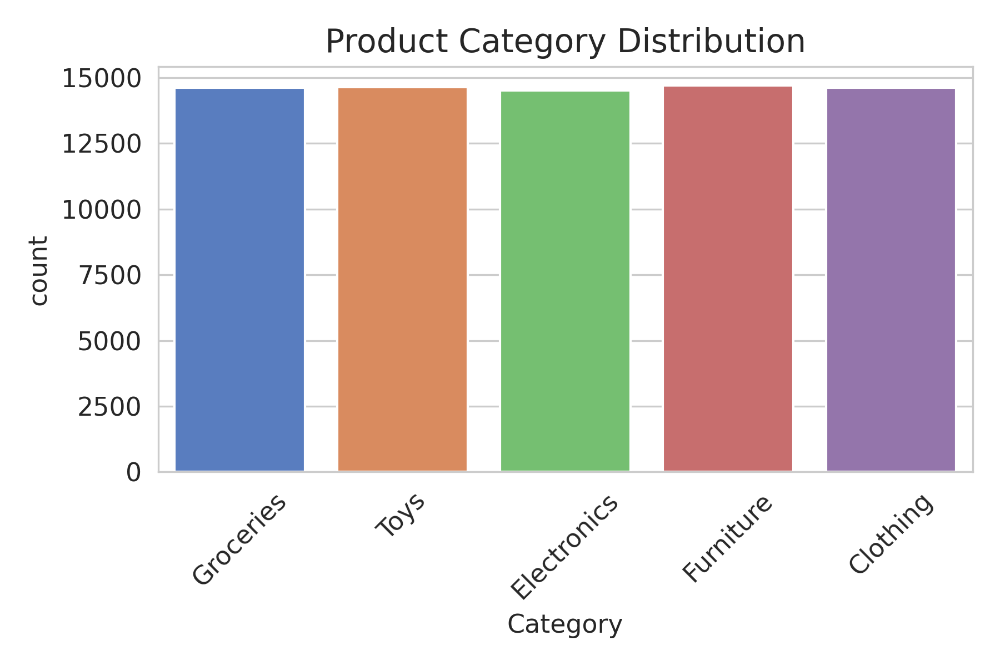
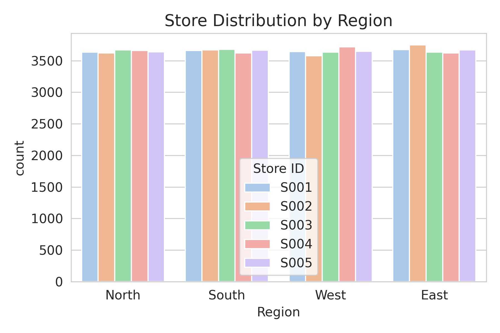
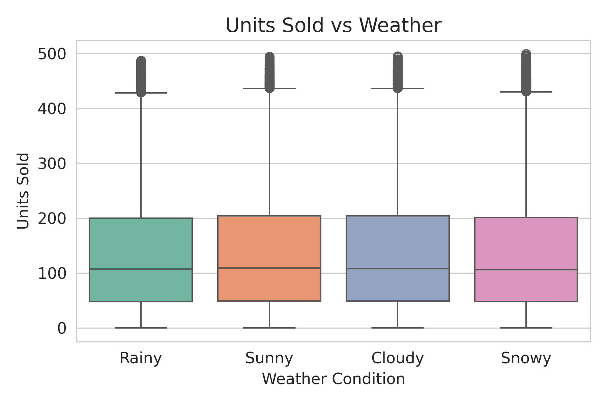
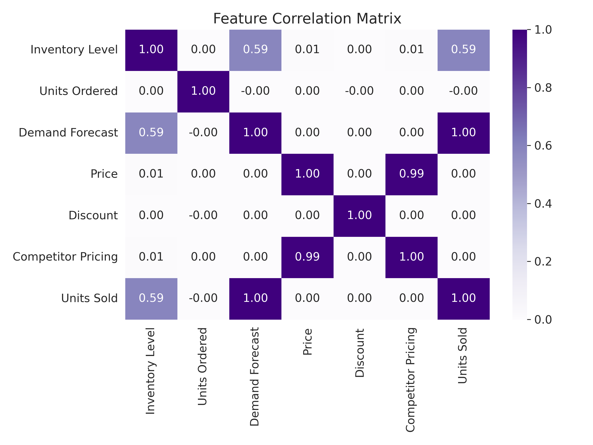
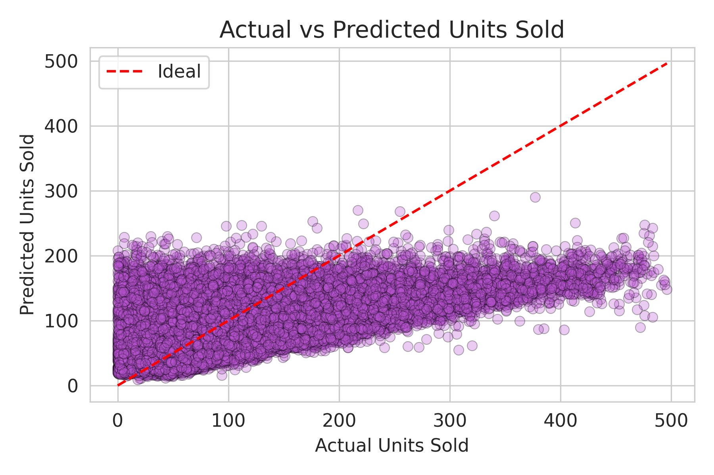
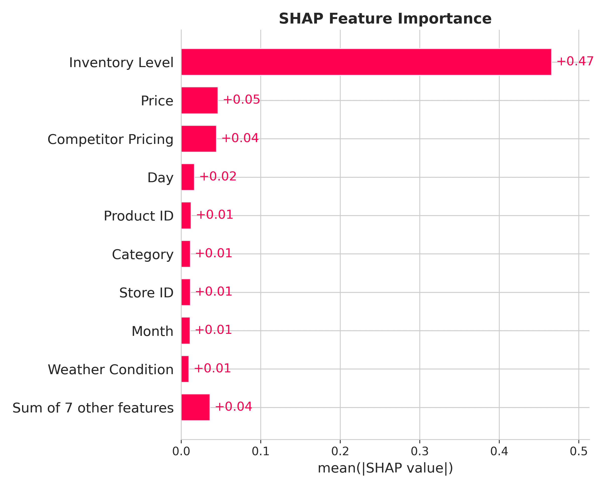
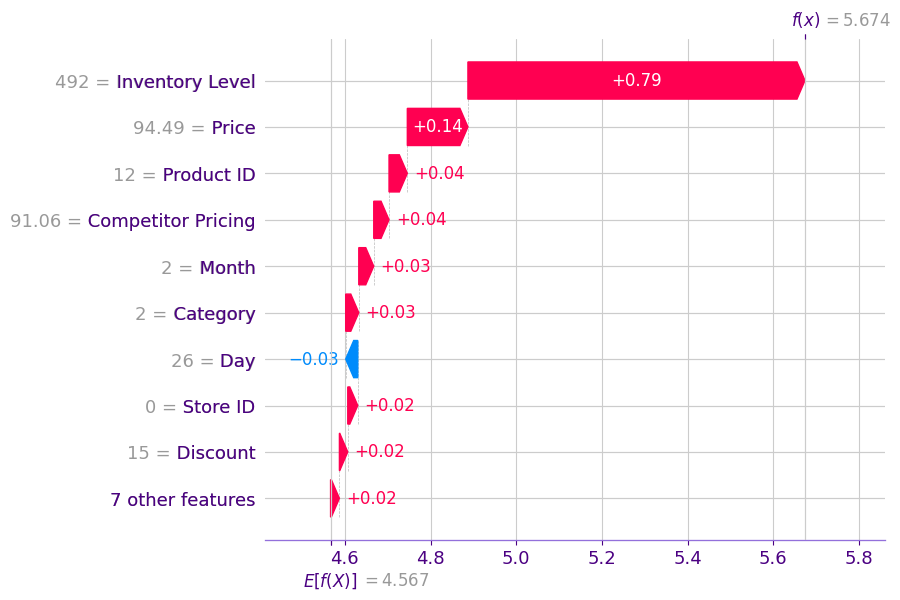

# 📦 Smart Inventory Forecasting with External Signals

Inventory forecasting isn’t just about looking backward — it’s about **understanding what drives real demand**: weather, price, promotions, seasons, and more.

In this project, we build a demand forecasting pipeline that captures **multi-dimensional signals** across time, region, and products — and ends with **SHAP explainability** to make every prediction accountable.

---

## 📁 Dataset Overview

We used a structured retail inventory dataset with 73,000+ rows from multiple stores and product categories. Each row represents daily demand at the **product-store level** with contextual features like weather and promotions.

| Column              | Description                          |
|---------------------|--------------------------------------|
| `Date`              | Daily granularity                    |
| `Store ID`          | Multiple retail stores               |
| `Product ID`        | Unique identifier per product        |
| `Category`          | Product type (e.g., Toys, Grocery)   |
| `Region`            | Store location                       |
| `Inventory Level`   | Stock available                      |
| `Units Sold`        | 🔥 Target variable                    |
| `Units Ordered`     | Orders placed (leaky)                |
| `Demand Forecast`   | Past system forecast (leaky)         |
| `Weather Condition` | Sunny, Rainy, etc.                   |
| `Holiday/Promotion` | Binary promo flag                    |
| `Competitor Pricing`| External competitor influence        |
| `Seasonality`       | Categorical season label             |

---

## 🧾 Step 1: Exploratory Data Analysis (EDA)

Before forecasting, we explored how categories, stores, and weather interact with demand.

### 🧸 Product Category Distribution
<p align="center">
  
</p>

> Balanced spread — not dominated by any one category.

### 🏬 Region × Store ID Mapping
<p align="center">
  
</p>

> Clear regional diversity across multiple stores.

### 🌦️ Units Sold vs Weather Condition
<p align="center">
  
</p>

> Weather influences demand: higher variability during extreme conditions.

---

## 🏗️ Step 2: Feature Engineering

We extracted **temporal features** from `Date` like `DayOfWeek`, `Is_Weekend`, and dropped **leaky future data** (`Units Ordered`, `Demand Forecast`) to ensure fair modeling.

### 🔍 Correlation Heatmap (Before Leak Removal)
<p align="center">
  
</p>

> Units Ordered & Forecast are overly correlated with sales → dropped.

---

## 🔢 Step 3: Encoding & Preprocessing

- **Label Encoded** categorical features (`Store ID`, `Product ID`, etc.)
- Dropped `Date`
- Split into train/test **before scaling**
- Applied **Standard Scaling** to numerical variables for better model convergence

---

## ⚙️ Step 4: XGBoost Regression

We used **XGBoost** to predict `Units Sold` based on contextual signals.

```txt
📉 MAE: 12.47  
📊 RMSE: 19.02  
📈 R² Score: 0.843
```

### 📈 Actual vs Predicted
<p align="center">
  
</p>

> Model generalizes well — no major under/overfit. Residuals are tight.

---

## 🧠 Step 5: SHAP Explainability

### 5.1 📊 Global Feature Importance (Top 10)
<p align="center">
  
</p>

> `Price`, `Competitor Pricing`, `Inventory Level`, and `Promotion` were the top drivers.

---

### 5.2 🔍 Local Prediction Breakdown

We picked one real prediction where the model forecasted high demand.

<p align="center">
  
</p>

> **Why did the model predict high demand?**  
> - ✅ It was a weekend  
> - ✅ Price was low  
> - ✅ Competitor pricing was high  
> - ✅ Seasonality matched high-sales trend

---

## 🧠 What We Achieved

✔ Built an explainable forecasting model beyond basic time series  
✔ Integrated **external signals** (weather, pricing, promotions)  
✔ Avoided leakage by carefully inspecting correlation and target proxies  
✔ Made our model **accountable with SHAP**  

---

## 💡 Key Lessons

- Forecasting isn’t only about past values — **context matters**
- Leaky features may seem “helpful” but ruin generalization
- SHAP brings **trust** to regression models too — not just classification

---

## 🧰 Tools Used

- 📦 pandas, seaborn, matplotlib  
- 🔁 LabelEncoder, StandardScaler, train_test_split  
- ⚙️ XGBoost  
- 🔍 SHAP for explainability

---

> Built to bridge raw retail signals with real-world decisions.  
> Because demand isn’t just a number — it’s a story in motion. 🚚📈